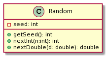
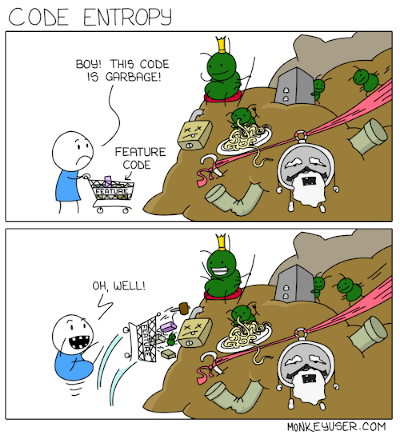
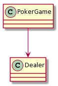
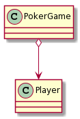
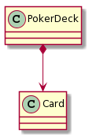
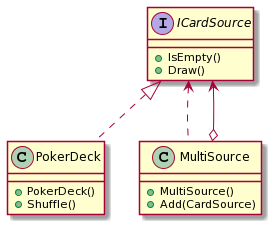
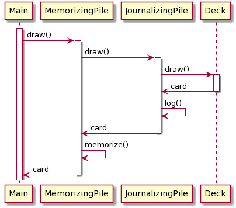
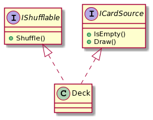
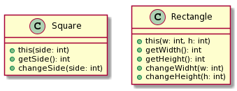

# INF1035 - Semaine 4

## Bibliographie de ce cours

## Composition versus Héritage

La matière de cette semaine concerne les mécanismes orienté-objet de composition et d'héritage. L'objectif est de décrire en détail le fonctionnement de ces mécanismes et de pouvoir les comparer et les utiliser dans les bons contextes.

Les notes de cours sont basées en partie sur des présentations créées par Sébastien Mosser, professeur à l'UQAM.

## Section 1 - Courte révision

### Quelques principes SOLID et la Loi de Demeter

Cette semaine, nous allons nous concentrer sur trois des principes SOLID énumérés dans la semaine 1 ainsi que sur la loi de Demeter. De quoi s'agit-il?

* **S**ingle Responsability Principle : un objet ne fait qu'une et une seule chose;
* **O**pen/Closed Principle : une évolution du projet minimise le nombre de modifications et exploite les capacités d'extension;
* **I**nterface Segregation Principle : on préfère des interfaces spécialisées à des objets fourre-tout

Et finalement, la loi de Demeter, ou le Principe de Moindre Connaissance (_Principe of Least Knowledge_), qui stipule qu'un objet devrait connaître le moins de choses possibles sur les autres objets du système (i.e. limiter le _couplage_).

> "_On ne parle pas avec les gens qu'on ne connait pas._"

### Encapsulation

L'encapsulation d'information est la mise en oeuvre du principe de l'"_Information Hiding_", ou le masquage d'information. Les données internes des objets sont _encapsulées_ (lire _cachées_) et les objets exposent des _services_ (méthodes). Ces services sont idéalement alignés avec la logique d'affaire de votre application (conceptualisation).

Ici, il faut comprendre l'intention de l'encapsulation : on veut limiter au minimum l'information que le système obtient sur la représentation interne des objets. La création de _getters_ et _setters_ pour chaque attribut, même si techniquement respecte l'encapsulation, est une mauvaise pratique car elle cause des _fuites de données_.

##### Mais pourquoi c'est si important?

Imaginons un scénario où une librairie offre une classe spécialisée Random, implémentée de la façon suivante :

La classe offre deux services : ``nextInt`` et ``nextDouble``. Elle expose aussi sa valeur interne ``seed`` via le _getter_ ``getSeed``.

Maintenant, imaginons qu'un utilisateur de cette librairie décide de faire usage de ``getSeed`` dans son programme pour une raison ou pour une autre (il en a le droit, ``getSeed`` fait maintenant partie du contrat de service de ``Random``).

Éventuellement, en faisant l'évolution de la librairie, les développeurs décident une autre méthode de générer des nombres au hasard qui n'utilise pas de _seed_ comme base. Malheureusement, comme certains utilisateurs dépendent potentiellement de ``getSeed``, qui était public, ils ne peuvent pas retirer la méthode ou ils briseraient la rétro-compatibilité de leur librairie. Ils devront créer une nouvelle classe avec un autre nom pour leur nouvelle méthode de génération.

Si la représentation interne de ``Random`` était resté cachée (i.e. on enlève ``getSeed`` de l'interface publique), les développeurs auraient pu la modifier sans risquer d'impacter les utilisateurs de la librairie.

## Section 2 - Relation de composition

En développement de logiciel, on crée des systèmes complexe par décomposition (_diviser pour mieux régner_). L'idée est de diviser la logique d'affaire en petites parties facilement codables et maintenables. Ensuite, ces petites parties sont connectées entre-elles par _composition_. 

En orienté-objet, la relation de composition entre les éléments est définie par deux concepts :

* Un objet peut être composé de différents autres objets
* Un objet peut déléguer un traitement à un de ses composants

Maintenir une bonne décomposition d'un projet est complexe. On se heurte au problème de trouver le chemin qui sera de moindre résistance lors de l'évolution et d'avoir donc à prédire dans quelle direction notre logiciel évoluera. Si on fait évoluer un logiciel sans guide ou prévision, on fait apparaître des "classes dieu" (i.e. classes qui font tout et n'importe quoi) très facilement.

##### Cas 1 : Un objet est composé de différents autres objets

Lorsqu'un élément fait partie d'un _agrégat_, on parle de composition. Par exemple, la classe ``CardPile`` est un agrégat d'instances de ``Card`` (_les cartes constituent la pioche_), une voiture contient 4 pneus, etc. Dans ces cas, la composition est dite _intrinsèque à la situation_ (i.e. les objets réflètent la réalité).

##### Cas 2 : Un objet délègue un traitement à un composant

Ce type de composition est plutôt conceptuelle que structurelle. 

> _Une partie de poker contient un croupier._

Dans la "vraie vie", il n'y a pas de relation de composition entre la partie de poker et le croupier, mais il est utile conceptuellement d'établir ce lien pour _casser la complexité d'un objet_ (éviter que la partie de poker devienne une "classe dieu"). L'idée est de maintenir le principe de responsabilité unique dans notre conception. Ici, le croupier deviendra un _fournisseur de service_ pour la partie de poker.

Il est **facile** et **dangereux** de simplement rajouter des choses directement dans une classe. Pas besoin de réfléchir à l'encapsulation, on voit tout! Mais en encapsulant et déléguant les services, on fait **diminuer l'_entropie_** dans le code.

### Représenter la composition

On parle de composition dès qu'un objet détient une référence vers un autre objet. Conceptuellement, il existe trois types de relations entre objets :

##### Association

  
L'objet a une dépendance vers un autre objet. Ici, ``PokerGame`` garde une référence vers ``Dealer`` pour lui déléguer du traitement. Chacun des objets peut exister indépendemment de l'autre et le lien peut être temporaire.

##### Aggrégation

  
L'objet maintient une liste de références vers un d'autres objets. ``PokerGame`` garde une référence vers la liste des joueurs actifs. L'objet parent peut exister indépendemment des objets enfants.

##### Composition

  
L'objet est structurellement fait à partir d'autres objets. ``PokerDeck`` est composé de ``Card``. Les objets sont intrinsèquement liés et l'objet parent ne peut exister sans les objets enfants.

L'impact de choix entre l'aggrégation et la composition est surtout conceptuel, mais peut quand même affecter le code dans certains langages de programmation. En C++, par exemple, on pourrait vouloir implémenter une composition avec des objets locaux et l'aggrégation avec des pointeurs ou références.

### Composition ≠ Sous-Typage

Une relation de composition n'implique en rien un sous-typage entre objets!

Un ``PokerDeck`` **est une** ``ICardSource``, mais n'est pas un ``IStack``; il **contient** une référence vers un ``IStack``. 

Pour que ``PokerDeck`` soit considéré comme un ``IStack``, il faudrait qu'il offre toutes les méthodes de l'interface ``IStack`` et **que ça soit sensé conceptuellement**. Par exemple, il n'y a aucune raison qu'un ``PokerDeck`` offre la méthode ``Push``.

### Un problème de composition : la _multi-pile_

Et si on voulait faire un jeu de poker avec deux jeux de cartes? Ou bien _n_ jeux de cartes?

On a deux choix de conceptions :

* Fabriquer une pile qui contient toutes les cartes des deux jeux;
* Fabriquer une pile qui est composée d'autres piles, une sorte de _pile composite_.

Le premier choix nécessite qu'on altère la représentation interne de la pile de carte pour permettre de _copier_ les cartes d'autres piles en elle.

Allons-y avec le deuxième choix.

#### Analyse de l'approche par composition

Cette approche a plusieurs avantages :

* ``MultiSource`` est de type ``ICardSource`` et peut donc être utilisé partout où ``ICardSource`` est nécessaire.
* _Couplage faible_ entre les classes. ``PokerDeck`` n'a aucune idée que ``MultiSource`` existe.
* On peut rajouter des sources dynamiquement dans ``MultiSource``.
* Pas de copie en mémoire.

Par contre, l'approche est un peu plus difficile à mettre en oeuvre que celle par copie et on doit savoir qu'une ``CardSource`` est une ``MultiSource`` pour pouvoir ajouter des sources.

    CardSource s1 = new PokerDeck();
    CardSource s2 = new PokerDeck();
    MultiSource ms = new MultiSource();
    ms.Add(s1);
    ms.Add(s2);
    
> _Cette forme est le patron de conception_ Composite _que nous étudierons en détail plus tard!_

### Un autre problème : Ajout de comportement

On veut maintenant une ``ICardSource`` qui puisse :

* Fonctionner normalement
* Journaliser les actions (exigence légale pour le casino)
* Mémoriser les cartes tirées (pour gagner au Blackjack 😇)

###### Bah, on peut rajouter un "mode" dans la source, non?

Et ensuite on décide en fonction du mode choisi...

Sauf que ça va nous donner un paquet de ``switch`` et une explosion combinatoire de modes si on décide d'en rajouter dans l'avenir!

Mauvaise idée.

#### Prosition : Composer les comportements

    Deck s1 = new Deck();
    s1.Shuffle();
    CardSource s2 = new JournalizingSource(s1);
    CardSource s3 = new MemorizingSource(s2);
    
    s3.Draw()

Ici on utilise l'héritage objet pour modéliser les comportements sous forme de composition. ``s3`` est une ``CardSource`` composée des comportements de ``Deck``, ``JournalizingSource`` et ``MemorizingSource``. Lorsqu'on apelle ``Draw()`` sur ``s3``, la méthode ``Draw()`` de ``MemorizingSource`` est appelée en premier, et cascade vers toutes les autres méthodes des parents.

Cette approche a certains avantages :

* Toutes les classes sont des ``CardSource`` et fonctionnent de la même manière
* _Couplage faible_ : chaque classe est indépendante des autres
* On peut rajouter des comportements dynamiquement pendant l'exécution
* Responsabilité unique
* Conception ouvert/fermé
* Facile de rajouter des nouveaux comportements (on crée une nouvelle classe de comportement)

Par contre, c'est à la création des objets qu'il y a certains désavantages. Le système se rempli de petits objets qu'il faut comprendre et dont l'ordre de construction peut importer. Nous avons aussi un problème d'identité entre objets : comment définirait-on ``Equals`` ici?

> _Cette forme est le patron de conception_ Décorateur _que nous étudierons en détail plus tard!_

## Section 3 - Relation d'héritage

Nous sommes déjà à la semaine 3 de "conception objet" et nous n'avons toujours pas parlé d'héritage... 

Nous avons parlé de composition qui permet de modulariser un système, de réalisation qui permet d'introduire un sous-typage (par intermédiare des interfaces en Java). On peut faire beaucoup de choses sans utiliser l'héritage. Il existe même des langages objets pour lesquels la construction d'héritage n'existe pas (ex: _Go_) et les langages fonctionnels n'utilisent pas d'héritage du tout.

Génalement, les gens abusent de la relation de généralisation et de l'héritage. Si vous êtes dans une situation où vous hésitez entre une relation de composition ou une généralisation, il vaut souvent mieux opter pour la composition.

Le mécanisme d'héritage, qui permet de facilement factoriser le code des classes similaires, repose fondamentalement sur la relation de généralisation des concepts associés. La contraposée de cette relation est intéressante, car elle permet de déterminer facilement l'usage abusif de d'héritage : _s'il n'y a pas de relation évidente de généralisation, ce n'est pas de une relation d'héritage_.

Autrement dit, pour qu'une classe hérite d'une autre conceptuellement, il est obligatoire de pouvoir établir une relation "**est un**" entre l'enfant et le parent. Par exemples : ``MemorizingSource`` **est une** ``ICardSource``, ``List`` **est une** ``IList``, ``TextField`` **est un** ``UIComponent``, etc.

Et la plupart des exemples ci-dessus sont implémentés par réalisation (interfaces) en C#!

### Du polymorphisme à l'héritage

En C#, le polymorphisme objet repose sur le sous-typage. La majorité du temps, ce sous-typage serait fait avec des _réalisations_ (interfaces). Dans les faits, **n'utiliser que des interfaces peut amener de la redondance dans le code**.

##### **D**on't **R**epeat **Y**ourself

Le principe DRY est très répandu en développement dans tous les paradigmes. En fait, chaque paradigme offre des mécanisme pour réduire la redondance dans le code : faire en sorte qu'on a pas à répéter le même code. En programmation fonctionnelle, on utilise des fonctions d'ordre supérieur (i.e. des fonctions qui prennent en paramètre d'autres fonctions). En _meta-programming_, on utilise des _macros_. 

En orienté-objet, le mécanisme de réutilisation est l'héritage.

###### Mais pourquoi on veut éviter de répéter du code?

Hormis l'avantage évident de pouvoir développer plus rapidement, le fait de répéter du code rend un programme vulnérable lors de l'évolution. 

Par exemple, imaginez que vous avez une fonction de calcul complexe qui est utilisée partout dans votre système. Au lieu de l'encapsuler dans une fonction ou une méthode, vous décidez de simplement copier-coller le code à chaque fois que vous en avez besoin.

Que se passe-t-il si vous avez un bogue à régler dans le calcul? Vous devez le régler partout où vous avez copier la fonction. Pire encore : que se passe-t-il si un des endroits a évolué différemment des autres (i.e. la fonction est subtilement différente à cet endroit). Votre _bugfix_ n'est peut-être même pas valide dans cette version de la fonction!

Dupliquer le code augmente énormément la dette technique d'un système.

##### La généralisation comme sous-typage

L'héritage met en oeuvre la réalisation de la relation de généralisation, et permet d'étendre une classe de base en sous-classe (souvent appelées classe parent et classe enfant). En d'autres termes, la généralisation, ou l'héritage, est une relation de sous-typage (comme la réalisation, ou les interfaces) en plus de réutilisation : la classe enfant _hérite_ du comportement de la classe parent.

#### Héritage et typage en C# et Java.

Pour chaque objet C# et Java, il existe **deux types** :

* Son type _run-time_ (R), attribué lors de la création de l'objet
* Son type _statique_ (S), soit le type de la variable associée à l'objet

Le type "réel" d'un objet est toujours son type R.

D'ailleurs, même dans les langages dits "non-typés", comme Python, les objets ont toujours un type R. La bonne classification de ces langages est "typé dynamiquement" plutôt que "non-typé".

En C# et Java, le compilateur garanti que R est un sous-type de S.

Par exemple : ``ISet<string> o = new HashSet<string>()``

* Le type R de ``o`` est ``HashSet<String>``
* Le type S de ``o`` est ``ISet<String>``
* R est un sous-type de S

En C# et Java, comme dans la majorité des langages de programmation, le type R d'un objet **ne change jamais** (Common Lisp est une exception notable où la fonction ``change-class`` permet de changer le type R d'un objet).

##### Surchage

En C# et Java, la surchage (_method overloading_) permet d'avoir deux méthodes avec le même nom mais de signature qui différe :

* Par son nombre de paramètres
* Par le type de ses paramètres
* Il n'est pas possible en C# ou Java de surcharger seulement sur le type de retour d'une méthode.

Chaque surcharge est en fait une méthode différente; rien ne changerait au code si elles avaient des noms différents. **C'est à la _compilation_ que la méthode cible est choisie, basé sur les types _S_ des paramètres.**

##### Polymorphisme objet

Le polymorphisme objet (_method overriding_, ou _dynamic dispatch_) permet plutôt de redéfinir une méthode d'une classe parent dans la classe enfant. La méthode enfant doit avoir **la même signature que la méthode parent**. 

En présence de polymorphisme, la méthode associée au type _R_ sera appelée.

##### Exemple 1

    public class Main {
        public static void Main(string[] argv) {
            A a = new A();
            B b = new B();
            A ab = b;
            
            Method(a);
            Method(b);
            Method(ab);
        }

        private static void Method(A object) {
            Console.WriteLine("I'm called on an A");
        }
        
        private static void Method(B object) {
            Console.Writeline("I'm called on a B");
        }
    }
    
Pour chaque appel de méthode, voici les résultats :

* ``Method(a)`` : _I'm called on an A_
* ``Method(b)`` : _I'm called on a B_
* ``Method(ab)`` : **_I'm called on an A_**

Comme nous sommes en présence de surcharge de méthode (``Method`` a deux versions avec un paramètre de type différent), la méthode associée au type S des objets est appelée. Le type S de ``a`` et ``ab`` est ``A`` et le type S de ``b`` est ``B``.

##### Exemple 2

    public class Main {
        public static void main(String[] args) {
            A a = new A();
            B b = new B();
            A ab = b;
            
            Console.WriteLine(a.toString());
            Console.WriteLine(b.toString());
            Console.WriteLine(ab.toString());
        }
    }
    
    public class A {
        public override string ToString() {
            return "I'm an A";
        }
    }
    
    public class B : A {
        public override string toString() {
            return "I'm a B";
        }
    }

Pour chaque appel de méthode, voici les résultats :

* ``a.ToString()`` : _I'm an A_
* ``b.ToString()`` : _I'm a B_
* ``ab.ToString()`` : **_I'm a B_**

Cette fois-ci, on utilise des méthodes polymorphes (_override_) et donc, le type R est utilisé pour déterminer quelle méthode appeler.

### Principe de substitution de Liskov

Lorsqu'on traite de généralisation, il est important de garder en tête la règle la plus importante : le principe de substitution de Liskov (le _L_ dans SOLID). Ce principe stipule qu'on doit pouvoir remplacer tout type par un de ses sous-types dans toutes les situations.

La généralisation est un mécanisme **strictement additif**. Lorsqu'on hérite d'une classe, on _ajoute_ toutes ses propriétés à notre classe enfant. Par exemples, un ``Deck`` réalise ``CardSource`` et ``Shufflable`` et donc a toutes les propriétés de ces deux types. 

Disons que nous voulions avoir le concept de ``UnshufflableDeck``, soit un jeu de carte qu'on ne peut mélanger. Pour respecter DRY, on hérite de ``Deck`` pour réutiliser ``IsEmpty`` et ``Draw``. Par contre, en faisant cela, on hérite aussi de ``Shuffle``! Il faudrait donc le redéfinir de cette façon :

    public void shuffle() {
        throw new InvalidOperationException();
    }

Mais en faisant cela on viole le principe de substitution de Liskov : ``UnshufflableDeck`` ne peut pas être substitué à ``Deck`` dans toutes les situations! Si une méthode qui prend en paramètre un type ``Deck`` reçoit un ``UnshufflableDeck`` et appelle ``Draw``, une ``InvalidOperationException`` sera lancée!

Une sous-classe ne doit pas restraindre ce que les cliens de la super-classe de cette instance feront avec.

Concrètement, voici les règles à respecter :

* Pas de pré-conditions plus strictes, ou post-conditions plus larges
* Ne pas prendre de type plus spécifique en paramètre
* Ne pas rendre la méthode moins accessible
* **Ne pas lever plus d'exceptions**
* Ne pas avoir un type de retour moins spécifique

_Pour aller plus loin : voir la covariance et contravariance dans le cours INF7845._

## Section 4 - Un petit exercice

Tentez de modéliser les concepts de carré et de rectangle en utilisant les concepts vus cette semaine. Voici les spécification des classes :

Votre concept doit respecter autant que possible les principes SOLID et DRY. 

Vous avez le droit de changer les types de retour des méthodes et d'en ajouter.

Nous discuterons des solutions possibles et des éventuels problèmes à la prochaine séance!
