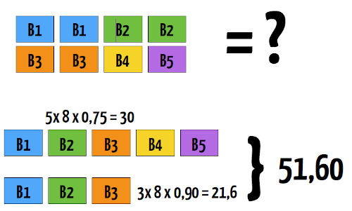
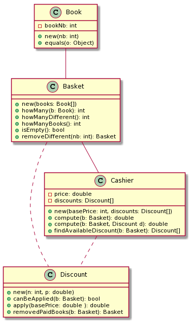

# Travail 1 - Harry Potter (Code Kata)

Le premier travail pratique consiste à compléter un programme en suivant une structure orientée-objet. 

Votre objectif principal dans les travaux pratiques est de faire passer les tests unitaires prédéfinis de chaque programme. Attention : les tests unitaires qui sont inclus dans le code source fourni sont des guides seulement; les tests unitaires qui seront utilisé pour la correction utiliseront des données différentes. Inutile d'essayer de tricher en faisant du code spécifique pour les tests unitaires ;)

#### Spécifications

Les 5 premiers livres de la saga Harry Potter sont à vendre dans une librairie. Chaque livre coûte 8$. La librairie applique certaines politiques de rabais en fonction du total des achats qui sont faits :

* 2 livres différents : 5%
* 3 livres différents : 10%
* 4 livres différents : 20% 
* 5 livres différents : 25%

Il faut concevoir un programme qui reçoit en entrée une liste de livres et qui retourne le prix total incluant les rabais applicables.

Attention par contre, un rabais peut s'appliquer plus d'une fois sur la même liste d'articles!

#### À faire

Heureusement, nous avons déjà conçu la structure du programme en classe durant la première séance. Tout ce qui vous reste à faire est à implémenter les méthodes manquantes pour que tout fonctionne. 

Voici le graphe UML de la structure montée en classe :

    class Book {
        - bookNb: int
        + new(nb: int)
        + equals(o: Object)
    }

    class Basket {
        + new(books: Book[])
        + howMany(b: Book): int
        + howManyDifferent(): int
        + howManyBooks(): int
        + isEmpty(): bool
        + removeDifferent(nb: int): Basket
    }

    class Discount {
        + new(n: int, p: double)
        + canBeApplied(b: Basket): bool
        + apply(basePrice: double ): double
        + removedPaidBooks(b: Basket): Basket
    }

    class Cashier {
        - price: double
        - discounts: Discount[]
        + new(basePrice: int, discounts: Discount[])
        + compute(b: Basket): double
        + compute(b: Basket, Discount d): double
        + findAvailableDiscount(b: Basket): Discount[]
    }

    Book -- Basket
    
    Basket -- Cashier
    
    Cashier .. Discount
    
    Basket .. Discount

L'objectif ici est que vous preniez connaissance de l'impact qu'une bonne conception peut avoir sur le développement d'un logiciel: un problème qui semble complexe peut devenir presque trivial à résoudre une fois la bonne structure mise en place!

#### Récupération du code

Vous pouvez obtenir le code source à mettre à jour sur GitHub Classroom en utilisant le lien suivant : [https://classroom.github.com/a/fMsfizsL](https://classroom.github.com/a/fMsfizsL).

## Critères de correction

Comme il s'agit du premier travail et que les notions de conception objet n'ont pas encore toutes été vues, la correction se fera en conséquence : je m'attends à du code cohérent qui passe les tests unitaires et respecte la structure mise en place.

Un 20% de la note sera attribué pour la clarté et qualité du code. Cela signifie donner des noms significatifs à vos noms de méthodes et classes, avoir des méthodes simples et compréhensibles (commentaires peuvent parfois aider) et simplement en général être facile à lire.

| Critère                                        | Poids |
| ---                                            | ---   |
| Les tests unitaires passent (Partie 1)         | 70%   |
| La structure en place est respectée (Partie 1) | 20%   |
| Clarté et qualité du code                      | 10%   |

## Remise des travaux

Pour remettre votre travail, il suffira de faire un push de vos modifications vers le Github et je pourrai le récupérer à la date de remise. Vous pouvez dès aujourd'hui remettre votre travail, il n'y a pas de date minimale à attendre.

**Les travaux remis passé la date de remise ne seront pas évalués.**
